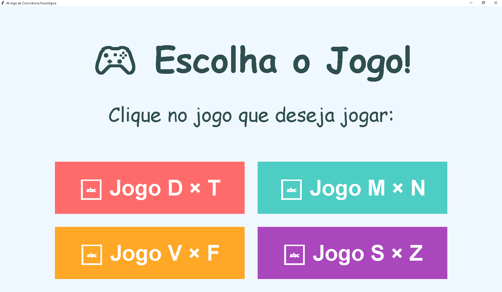
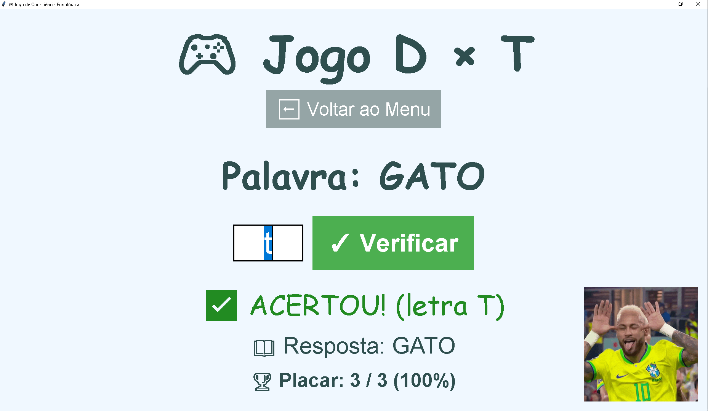
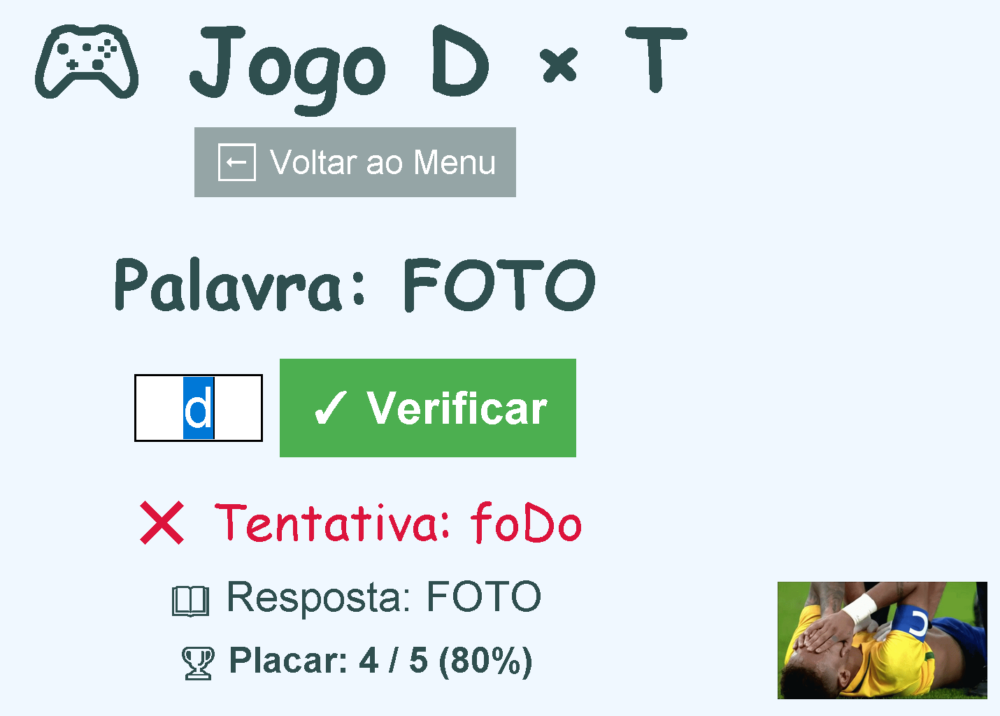

# 🎮 Jogo de Consciência Fonológica

Como pai, percebi que meu filho precisava de apoio extra no desenvolvimento da consciência fonológica — especialmente na diferenciação entre pares de letras que costumam confundir na alfabetização (D/T, M/N, V/F, S/Z). Os cadernos tradicionais estavam deixando as atividades monótonas e cansativas.

A solução? Gamificar o aprendizado! 🚀

Transformei os exercícios repetitivos em um jogo Python, aproveitando para aprender mais sobre o assunto, interativo, onde cada acerto é comemorado pelo Messi feliz ⚽✨ e cada erro vem com aquele "Messi chorando" que é tão icônico. Resultado: muito mais engajamento, diversão e, claro, aprendizado de verdade.

Este projeto nasceu da necessidade real de tornar a fonoaudiologia mais atrativa — automatizando o que antes era papel e caneta, e adicionando feedback visual que realmente motiva.

Deixo aqui meus créditos a minha querida Esposa, professora, que sempre me apoia com as suas lindas idéias (e eu que me vire depois hahaha).

## 📸 Demonstração

*Tela de seleção de modo de jogo*

*Interface durante o jogo*

*Interface durante o jogo*

---

## 🎯 Funcionalidades

- ✅ **Quatro modos de jogo**: D×T, M×N, V×F e S×Z
- ✅ **Quase 500 palavras** no total, distribuídas entre os 4 modos, com posições variadas da letra alvo
- ✅ **Feedback visual animado** com GIFs do Messi (acerto/erro)
- ✅ **Sistema de pontuação** em tempo real com percentual
- ✅ **Interface escalável** (2x para melhor visualização)
- ✅ **Menu em grade 2x2**, pensado para caber bem mesmo em telas menores
- ✅ **Validação de entrada** inteligente (só aceita as letras válidas do modo escolhido)
- ✅ **Testes unitários** integrados
- ✅ **Logging detalhado** para debug

---

## 🛠️ Tecnologias Utilizadas

| Tecnologia        | Uso                           |
|-------------------|-------------------------------|
| **Python 3.8+**   | Linguagem base                |
| **Tkinter**       | Interface gráfica             |
| **Pillow (PIL)**  | Manipulação de GIFs animados  |
| **Type Hints**    | Código mais robusto           |
| **Dataclasses**   | Modelagem de dados            |

---

### Pré-requisitos
- Python 3.8 ou superior
- pip (gerenciador de pacotes)

## 🎮 Como Usar

1. **Inicie o jogo** executando `python main.py`
2. **Selecione o modo**, no menu em grade 2x2:
   - **D × T**: Diferenciação entre D e T
   - **M × N**: Diferenciação entre M e N
   - **V × F**: Diferenciação entre V e F
   - **S × Z**: Diferenciação entre S e Z
3. **Complete as palavras** digitando a letra que falta
4. **Pressione Enter** ou clique em "Verificar"
5. **Acompanhe sua evolução** no placar
6. **Volte ao menu** a qualquer momento

### Atalhos
- `Enter`: Verificar resposta / Próxima palavra
- `Escape`: Voltar ao menu (futuro)

---

## 🧪 Testes

O projeto inclui testes unitários automáticos:
**Cobertura de testes:**
- ✅ Mascaramento de palavras
- ✅ Validação de entrada (para os 4 modos)
- ✅ Verificação de respostas (para os 4 modos)
- ✅ Construção de desafios (para os 4 modos)
- ✅ Garantia de que nenhuma palavra do banco é descartada por índice/ocorrência inválidos

---

## 📊 Banco de Palavras

Cada modo segue a mesma estrutura: palavras fáceis (letra no início), médias (letra no meio/fim) e difíceis (palavras mais longas), definidas como `(palavra, letra[, ocorrência])` e resolvidas automaticamente para o índice correto.

### Modo D×T
- Palavras com **T** e com **D**
- Posições variadas: início, meio, fim

### Modo M×N
- Palavras com **M** e com **N**
- Contextos diversos (vogais, consoantes)

### Modo V×F
- Palavras com **V** e com **F**
- Posições variadas: início, meio, fim

### Modo S×Z
- Palavras com **S** e com **Z**
- Posições variadas: início, meio, fim

**Total: quase 500 palavras únicas entre os 4 modos**

---

## 🎨 Design e UX

- **Cores acessíveis** para crianças
- **Fontes grandes** (Comic Sans MS / Arial)
- **Feedback claro** (✅ verde / ❌ vermelho)
- **Animações motivadoras** (GIFs do Messi)
- **Interface minimalista** sem distrações
- **Menu em grade**, para não estourar a altura da janela em telas menores

---

## 🐛 Troubleshooting

### GIFs não aparecem
- Verifique sua conexão com a internet
- Os GIFs são baixados de URLs externas
- Logs no console indicam falhas

### Problema de escala DPI
- O jogo tenta ajustar automaticamente
- Em caso de falha, redimensione a janela manualmente

### Botões do menu cortados / não aparecem
- A janela é redimensionável; se ainda assim algum botão não aparecer, tente maximizar a janela
- O menu usa uma grade 2x2 justamente para evitar isso em telas menores

---

## 📄 Licença

Este projeto está sob a licença **MIT**. Veja o arquivo [LICENSE](LICENSE) para mais detalhes.

---

## 👨‍💻 Autor

**Douglas**

- GitHub: [@yegor77](https://github.com/yegor77)
- LinkedIn: [@douglasfch](https://www.linkedin.com/in/douglasfch/)